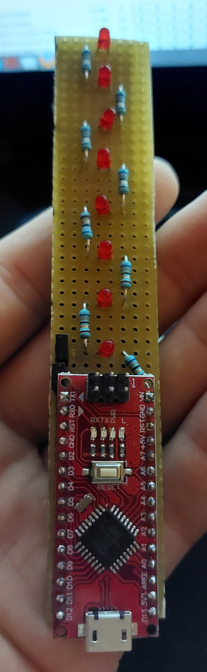
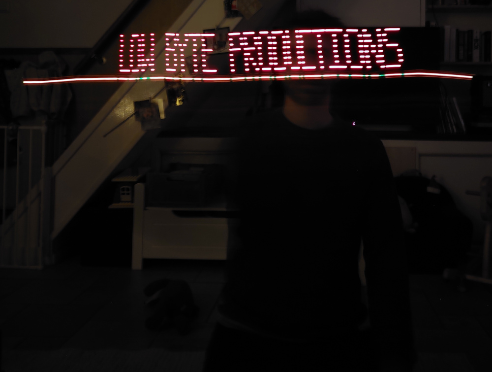
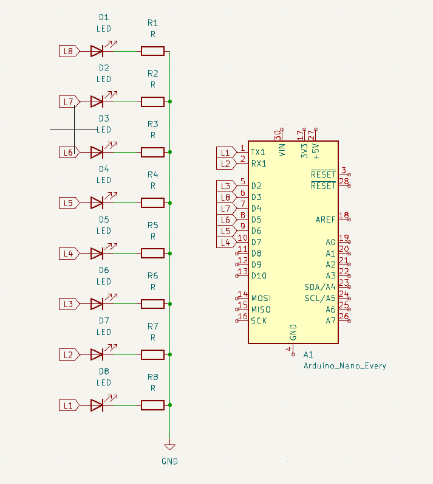

# Persistence of vision

This project implements persistence of vision from scratch on an arduino nano (without the arduino framework). The effect can be seen when taking a long exposure photo, and moving either the camera or the device linearly.


<hr>


## Building



```bash
make
make flash
```

*Note: This assumes you have the arduino bootloader installed on the nano. If not, you'll need to flash the built hex file using the ISP*

## Notes

If you're building this yourself, you may need to tweak the baudrate setting in the makefile. I used a knock-off nano, which is markedly slower and pickier than the official ones.
